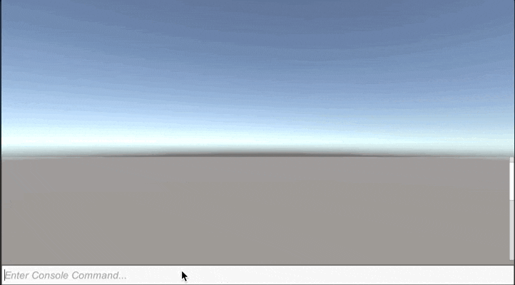

# In-Game Developer Console #

The In-Game Developer Console provides an interactable in-game console similar to ones found in:

* Counter Strike series
* Quake 4
* Elder Scrolls/Fallout series

It is a miminalistic Unity tool and comes packaged with:

* Global Event Handler
* Relative Event Handler
* Customizable UI
* Unix Terminal like behaviours such as storing previous commands (aka `.bash_history`)

Allowing *any* developer or user to interact and modify/execute controllable properties or functions 
when the game is **built** or in **play mode**.

## How does it work? ##

Methods are subscribed to one of two internal tables within the

* `GlobalEventHandler`
* `RelativeEventHandler`

Once subscribed these methods can be invoked from any class within your project. The Console's Input uses 
this system to target events and their methods to invoke.

The class responsible for executing console commands and their associated methods from the input is the 
`ConsoleCmdExecutor`. This takes the string from the Console's UI and parses all of the arguments into 
their assumed types.

Example:

> Heal 50

Would execute the method "Heal" and pass "50" as a `float` or `int`.

> Heal Bob 50

Would execute the method "Heal", pass "Bob" as a `string`, and `50` as a `float` or `int`.

The `ConsoleCmdExecutor` is hooked up to the `Developer Console` prefab via `UnityEvents`. (See below.)


### Preview ###



## Event Subscription/Invocation ##

### GlobalEventHandler ###

The `GlobalEventHandler` typically should be used for system wide events that affects every instance.

```
// GlobalEventHandler subscription
using UnityEngine;
using GlobalEvents;

public class Health : MonoBehaviour {

    private void ToggleGodMode() {
        // Toggling god mode implementation goes here
    }
    
    private void OnEnable() {
        // Subscribe the event with a unique event name and the method
        GlobalEventHandler.SubscribeEvent("tgm", ToggleGodMode);
    }
    
    private void OnDisable() {
        // Unsubscribe the event if you want to remove it
        GlobalEventHandler.UnsubscribeEvent("tgm", ToggleGodMode);
    }
}

public class AnotherClass : MonoBehaviour {

    private void Update() {
        if (Input.GetKeyUp(KeyCode.Space)) {
            // Invoke the ToggleGodMode from another class
            GlobalEventHandler.InvokeEvent("tgm");
        }
    }
}
```

### RelativeEventHandler ###

The `RelativeEventHandler` is recommended to be used for specific invocations on specific objects. This is still 
very much a **WIP** since it uses `Reflections` to do this. There is a .NET 4.5 compatible `RelativeEventHandler` which 
avoids using `Reflections` altogether. More details will come soon.

```
// RelativeEventHander subscription
using UnityEngine;
using GlobalEvents;

public class Health : MonoBehaviour {

    private void Heal(float amount) {
        // Heal implementation goes here
    }
    
    private void OnEnable() {
        // Subscribe the event with the name of the method and the instance
        // of object
        RelativeEventHandler.SubscribeEvent("Heal", this);
    }
    
    private void OnDisable() {
        // Unsubscribe the event if you want to remove it
        // You only need the name of the method to unsubscribe from the
        // RelativeEventHandler
        RelativeEventHandler.UnsubscribeEvent("Heal");
    }
}

public class AnotherClass : MonoBehaviour {
    
    private void Start() {
        // Invoke the Heal event on start with a value of 50
        RelativeEventHandler("Heal", 100f);
    }
}
```

