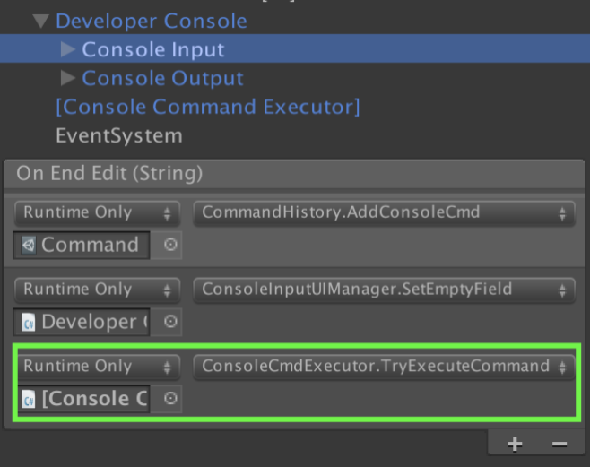

# In-Game Developer Console #

The In-Game Developer Console provides an interactable in-game console similar to ones found in:

* Counter Strike series
* Quake 4
* Elder Scrolls/Fallout series

It is a miminalistic Unity tool and comes packaged with:

* Global Event Handler
* Relative Event Handler
* Customizable UI
* Unix Terminal like behaviours such as storing previous commands (aka `.bash_history`)

Allowing *any* developer or user to interact and modify/execute controllable properties or functions 
when the game is **built** or in **play mode**.

#### **NOTE**: The project is still in *early* beta and I'll be updating/testing it. ####

## How does it work? ##

Methods are subscribed to one of two internal tables within the

* `GlobalEventHandler`
* `RelativeEventHandler`

Once subscribed these methods can be invoked from any class within your project. The Console's Input uses 
this system to target events and their methods to invoke.

The class responsible for executing console commands and their associated methods from the input is the 
`ConsoleCmdExecutor`. This takes the string from the Console's UI and parses all of the arguments into 
their assumed types.

Example:

> Heal 50

Would execute the method "Heal" and pass "50" as a `float` or `int`.

> Heal Bob 50

Would execute the method "Heal", pass "Bob" as a `string`, and `50` as a `float` or `int`.

The `ConsoleCmdExecutor` is hooked up to the `Developer Console` prefab via `UnityEvents`. (See below.)



### Preview ###


## Event Subscription/Invocation ##

### GlobalEventHandler ###

The `GlobalEventHandler` typically should be used for system wide events that affects every instance.

```
// GlobalEventHandler subscription
using UnityEngine;
using GlobalEvents;

public class Health : MonoBehaviour {

    private void ToggleGodMode() {
        // Toggling god mode implementation goes here
    }
    
    private void OnEnable() {
        // Subscribe the event with a unique event name and the method
        GlobalEventHandler.SubscribeEvent("tgm", ToggleGodMode);
    }
    
    private void OnDisable() {
        // Unsubscribe the event if you want to remove it
        GlobalEventHandler.UnsubscribeEvent("tgm", ToggleGodMode);
    }
}

public class AnotherClass : MonoBehaviour {

    private void Update() {
        if (Input.GetKeyUp(KeyCode.Space)) {
            // Invoke the ToggleGodMode from another class
            GlobalEventHandler.InvokeEvent("tgm");
        }
    }
}
```

### RelativeEventHandler ###

The `RelativeEventHandler` is recommended to be used for specific invocations on specific objects. This is still 
very much a **WIP** since it uses `Reflections` to do this. There is a .NET 4.5 compatible `RelativeEventHandler` which 
avoids using `Reflections` altogether. More details will come soon.

```
// RelativeEventHander subscription
using UnityEngine;
using GlobalEvents;

public class Health : MonoBehaviour {

    private void Heal(float amount) {
        // Heal implementation goes here
    }

    private void Heal(float amount, string message) {
        Heal(amount);
        Debug.Log(message);
    }
    
    private void OnEnable() {
        // Subscribe the event, the instance of the object, and the method "Heal"
        // We can subscribe multiple methods to the event "Repair"
        RelativeEventHandler.SubscribeEvent("Repair", this, "Heal");
    }
    
    private void OnDisable() {
        // Unsubscribe the method "Heal" from the event "Repair"
        // Keep in mind that overloaded functions will also be removed
        RelativeEventHandler.UnsubscribeEvent("Repair", this, "Heal");
    }
}

public class AnotherClass : MonoBehaviour {
    
    // Store the reference of the instance of Health
    public Health health;
    
    private void Start() {
        // Invoke the Heal event on start with a value of 100
        RelativeEventHandler.InvokeEvent("Repair", health, new object[] { 50f });

        // To invoke the other overlaoded function
        RelativeEventHandler.InvokeEvent("Repair", health, new object[] { 50f, "Healed!" });
    }
}
```

### Executing Relative Events from the Console ###
Since the console doesn't have a concept of components and `gameObjects`, they are referenced via their instance ID. 
Therefore, each instance Id and gameObject pair must be cached upon instantiation and removed upon destruction.

```
using UnityEngine;
using GlobalEvents;
using Console;

public class Health : MonoBehaviour {

    private void OnEnable() {
        // Subscribe the event, the instance of the object, and the method "Heal"
        // We can subscribe multiple methods to the event "Repair"
        RelativeEventHandler.SubscribeEvent("Repair", this, "Heal");

        // Cache the instance of the object and the instance id.
        IdCache.CacheInstanceId(id, this);
    }

    private void OnDisable() {
        // Unsubscribe the method "Heal" from the event "Repair"
        // Keep in mind that overloaded functions will also be removed
        RelativeEventHandler.UnsubscribeEvent("Repair", this, "Heal");
        
        // Remove the instance id when the gameObject is disabled/destroyed 
        IdCache.RemoveInstanceId(GetInstanceId());
    }
}
```


### Logging Events to Console ###
Logging a custom message to the console uses the `GlobalEventHandler` internally and it takes one line of code! 
See the example below.

```
using Console.Events;
using GlobalEvents;
using UnityEngine;

public class ClearFieldUtility : MonoBehaviour {

    private void OnEnable() {
        GlobalEventHandler.SubscribeEvent("killall", WipeAllEnemies);
    }

    private void OnDisable() {
        GlobalEventHandler.UnsubscribeEvent("killall", WipeAllEnemies);
    }

    private void WipeAllEnemies() {
        // Implementation of clearing all enemies logic goes here

        // To add an output message to the console, invoke ConsoleOuput.Log(string, colour)
        // Since it's using Unity's UI text, rich text format is automatically supported
        ConsoleOutput.Log("Your custom message goes here", Color.red);
    }
}
```

Every time `WipeAllEnemies` is invoked, adding an output to the console would subsequently be invoked. 
See the gif below for an example of the above occurring.


